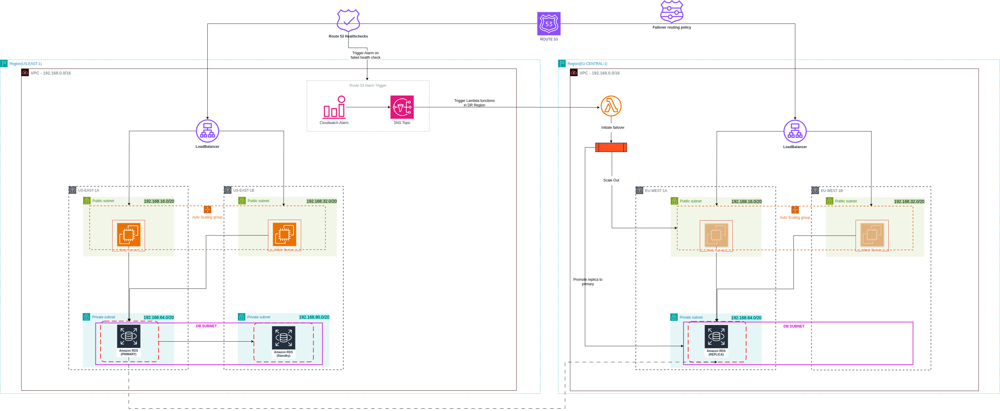

# AWS Disaster Recovery (DR) Infrastructure Project Documentation

## Overview
This project implements a resilient **Disaster Recovery (DR)** strategy on AWS by deploying a **multi-region** architecture. It designates one region as the **primary (active)** environment and another as the **secondary (passive)** standby, ready to take over during a failure. The entire infrastructure is codified and automated using **Terraform**, prioritizing high availability, fault tolerance, and ease of handover for future DevOps teams.

---

## Architecture Diagram

Below is a high-level architecture diagram illustrating the AWS Disaster Recovery setup:



### Diagram Explanation:
- The **primary region** hosts the active environment, including EC2 instances, RDS, and other resources.
- The **secondary region** is configured as a passive standby, with resources like RDS read replicas and ASG set to minimal capacity.
- **Route 53** ensures DNS-based failover, while **CloudWatch, SNS, and Lambda** automate recovery actions.
- **S3 cross-region replication** ensures critical data is synchronized between regions.

Ensure the `assets/` directory contains the `aws-dr-architecture.png` file for the image to render correctly.

## Project Directory Structure

```
project-root/
│
├── environments/
│   ├── active/
│   │   ├── main.tf
│   │   ├── terraform.tfvars
│   │   └── provider.tf
│   └── passive/
│       ├── main.tf
│       ├── terraform.tfvars
│       └── provider.tf
│
├── modules/
│   ├── vpc/
│   ├── ec2/
│   ├── rds/
│   ├── s3/
|   ├── iam/
|   ├── lambda/
|   ├── acm/
|   ├── sg/
│   └── route53/
│
├── functions/
│   └── (zipped Lambda deployment packages)
│
└── scripts/
    └── (supporting automation and management scripts)
```

### Explanation:
- **Active/Passive environments** represent the primary production region and the disaster recovery region.
- Shared **Terraform modules** enforce consistent infrastructure definitions across both environments.
- **Functions/** contains pre-packaged Lambda zip files for DR automation.
- **Scripts/** includes bash or Python scripts used for deployment, testing, or manual intervention.
- **Remote Terraform state** is managed in an S3 bucket with DynamoDB state locking to ensure safe parallel changes and recovery.

---

## Key Engineering Components

### 1. **DNS-Based Failover with Route 53**
Route 53 is configured with **failover routing policies** and **HTTPS health checks** that monitor an application-specific endpoint (`/crud_app/health.php`) in the primary region.

- If the health check fails consecutively (5 failures every 30s), traffic is rerouted from the active region to the passive region automatically.
- **DNS Records** use the following failover configuration:
  - `PRIMARY` record for the active region (with health check)
  - `SECONDARY` record for the passive region (without health check)

This ensures seamless redirection with minimal user interruption during a regional outage.

### 2. **Event-Driven Recovery with CloudWatch, SNS, and Lambda**
A **CloudWatch alarm** monitors the Route 53 health check status (`HealthCheckStatus`). When a failure is detected, it triggers a tightly coordinated set of recovery actions via SNS and Lambda.

#### 🔧 Architectural Challenge: Cross-Region SNS Limitations
CloudWatch cannot trigger an SNS topic in another region directly. To solve this:
- SNS is deployed in the **same region as the CloudWatch alarm**.
- This SNS **invokes a Lambda function** deployed in the **DR region** using **cross-region invocation**.

#### ✅ Lambda Functions in DR Region:
1. **Scale Out EC2 Instances** by modifying the ASG desired capacity.
2. **Promote RDS Read Replica** to become the new master database.

This fully automates failover and reduces human intervention.

### 3. **RDS Deployment and Recovery Strategy**
The RDS instance in the passive region is maintained as a **read replica** of the active region's primary database.

- In a disaster event, the DR Lambda function:
  - Promotes the read replica to become a standalone, writable database.
  - Allows applications to continue functioning with minimal data loss.

This design ensures a **low RPO**, as the read replica continuously replicates data from the master.

### 4. **Automated Backups and Point-in-Time Recovery (PITR)**
AWS RDS automated backups are configured to:
- Take **daily snapshots** (typically early morning UTC)
- Capture **transaction logs continuously**

In the event of total failure:
- A new RDS instance can be restored to any second before the failure.
- This enables **precise recovery** with almost zero data loss.

---

## Recovery Timeline Definitions

| Component         | Target RPO       | Target RTO         |
|-------------------|------------------|--------------------|
| EC2 Instances     | 0 minutes        | < 10 minutes       |
| RDS (read replica)| ~1–5 minutes     | 5 minutes          |
| S3 Static Assets  | 1-2 minutes      | < 5 minutes        |
| Route 53 Failover | Immediate        | < 1 minute         |

### Definitions:
- **RPO (Recovery Point Objective)**: Maximum acceptable amount of data loss
- **RTO (Recovery Time Objective)**: Maximum acceptable time to restore service

Example Scenario:

If the active region becomes unavailable at 03:15 UTC:

Route 53 reroutes traffic to the passive region by 03:16.

Lambda in the DR region triggers EC2 instance provisioning and RDS promotion immediately.

Full recovery completes by approximately 03:25 UTC with minimal data loss.

These estimates were validated through controlled simulations and real-time monitoring.


These targets were validated through simulation and metric observation.

---

## Monitoring and Alerting Components

Monitoring and alerting are critical for detecting application failures and triggering automated recovery workflows.

In this setup, Route 53 health checks are configured to continuously monitor the application's endpoint (/crud_app/health.php) in the primary region. These checks are performed every 30 seconds, and if five consecutive failures are detected, the application is considered unhealthy.

This health status is observed by an Amazon CloudWatch alarm, which monitors the Route 53 health check metrics. When the alarm is triggered, it sends a notification to an SNS topic that has been set up in the same AWS region. The SNS topic acts as a messaging bridge to inform systems of the detected failure.

The SNS topic then invokes a Lambda function that resides in the disaster recovery region. This Lambda function executes predefined recovery logic, including promoting the read replica database and scaling out EC2 instances in the passive region. This coordinated response ensures a near real-time reaction to service outages with minimal manual intervention.

## Cost and Optimization Considerations

Disaster recovery infrastructure introduces additional cost overhead, so engineering trade-offs are necessary to keep DR setups cost-efficient while maintaining resilience.

### 1. **Passive Region Optimization**
- Configure **ASG desired capacity = 0** to keep EC2 instances off by default.
- Use **EC2 Image Builder** and **user data scripts** for fast provisioning.
- Use **on-demand RDS read replicas** and promote only during failover.

### 2. **Pay-Per-Use Serverless Operations**
- Lambda and SNS incur cost only during execution.
- All DR logic is event-driven, avoiding idle cost buildup.

### 3. **S3 Cross-Region Replication Efficiency**
- Replicate only critical buckets.
- Use **lifecycle policies** to transition older objects to Glacier.

### 4. **Minimal Health Check Setup**
- Route 53 health checks incur minor charges.
- Monitor only the application’s most critical endpoint.

### 5. **Terraform Cost Control**
- Use `count`, `for_each`, and conditional logic to provision resources only in the needed regions.
- Enable **modular design** for reuse and version control.

---

